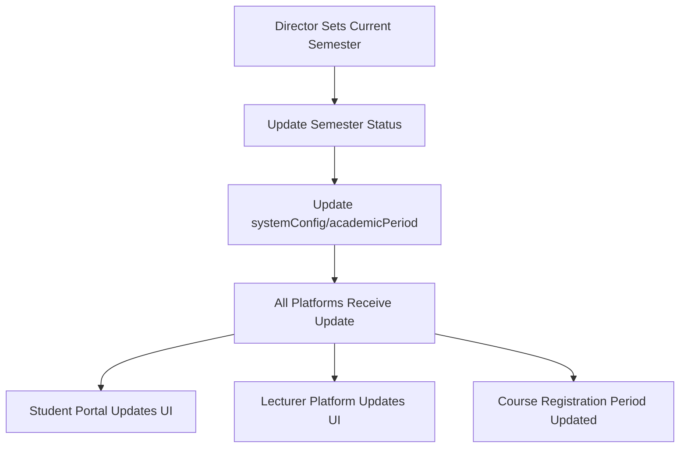
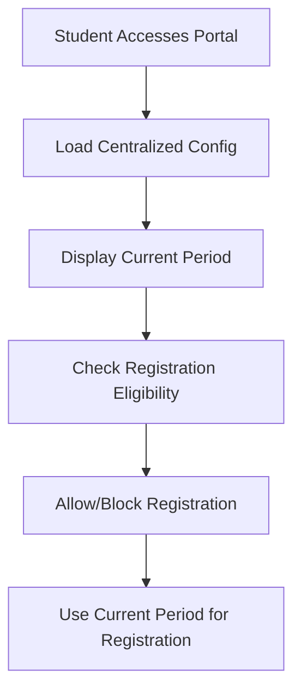

# 🎓 Centralized Academic Year System

## Overview
The UCAES system now uses a centralized academic year configuration that ensures all platforms (Director, Student Portal, Lecturer Platform) use the same academic period settings. This prevents inconsistencies and ensures proper synchronization across the entire system.

## 🔧 How It Works

### 1. Central Configuration Document
The system uses a single Firestore document to store the current academic period:
```
Collection: systemConfig
Document: academicPeriod
```

**Document Structure:**
```javascript
{
  currentAcademicYear: "2024/2025",
  currentAcademicYearId: "year-id",
  currentSemester: "First Semester",
  currentSemesterId: "semester-id",
  currentProgramType: "Regular", // or "Weekend"
  lastUpdated: Timestamp
}
```

### 2. Director Control
Only the Director of Academic Affairs can set the current academic year and semester:

**Setting Current Semester:**
1. Navigate to Academic Management in Director Portal
2. Select the desired semester
3. Click "Set as Current Semester"
4. The system automatically updates the centralized config

**What Happens When Director Sets Current Semester:**
- Previous semester of the same program type is marked as 'completed'
- New semester is marked as 'active'
- `systemConfig/academicPeriod` document is updated
- All platforms receive real-time updates

### 3. Student Portal Integration
The Student Portal automatically uses the centralized configuration:

**Real-time Updates:**
- Listens to changes in `systemConfig/academicPeriod`
- Automatically updates course registration period
- Shows current academic period with "Centralized Configuration" badge
- Prevents registration outside current period

**Display Features:**
- Current Academic Period: Shows the centralized year and semester
- Program Type: Indicates Regular or Weekend program
- Centralized Badge: Confirms the configuration is from director

### 4. Lecturer Platform Integration
Lecturers also use the same centralized configuration for:
- Course assignments
- Grade submissions
- Academic period awareness

## 🚀 Benefits

### ✅ Consistency
- All platforms use the same academic period
- No more mismatched semesters between systems
- Unified academic calendar across the institution

### ✅ Real-time Synchronization
- Changes made by director immediately reflect everywhere
- No manual updates needed on other platforms
- Automatic notifications when period changes

### ✅ Data Integrity
- Prevents registration in wrong semesters
- Ensures proper course assignments
- Maintains academic record accuracy

### ✅ Administrative Control
- Single point of control for academic periods
- Clear audit trail of period changes
- Proper academic year management

## 🔄 Workflow

### Director Sets Academic Period


### Student Registration Process


## 🧪 Testing

### Test Script
Run the centralized academic year test:
```bash
node scripts/test-centralized-academic-year.js
```

### Manual Testing
1. **Director Portal:**
   - Set current semester
   - Verify systemConfig is updated
   - Check other semesters are deactivated

2. **Student Portal:**
   - Verify current period is displayed
   - Check registration uses correct period
   - Confirm real-time updates work

3. **Lecturer Platform:**
   - Verify current period is shown
   - Check course assignments use correct period

## 🐛 Troubleshooting

### Issue: Student Portal Not Using Centralized Config
**Symptoms:** Student portal shows different academic period than director set

**Solutions:**
1. Check `systemConfig/academicPeriod` document exists
2. Verify student portal is listening to the correct document
3. Check Firebase permissions
4. Restart student portal application

### Issue: Real-time Updates Not Working
**Symptoms:** Changes don't reflect immediately across platforms

**Solutions:**
1. Check Firebase connection
2. Verify onSnapshot listeners are active
3. Check browser console for errors
4. Ensure proper error handling in components

### Issue: Director Can't Set Current Semester
**Symptoms:** Error when trying to set current semester

**Solutions:**
1. Check Firebase permissions for director account
2. Verify academic years and semesters exist
3. Check for conflicting active semesters
4. Review error logs in browser console

## 📋 Configuration

### Required Firebase Rules
```javascript
// Allow read access to systemConfig for all authenticated users
match /systemConfig/{document} {
  allow read: if request.auth != null;
  allow write: if request.auth != null && 
    get(/databases/$(database.name)/documents/users/$(request.auth.uid)).data.role == 'director';
}
```

### Environment Variables
No additional environment variables required. The system uses existing Firebase configuration.

## 🔮 Future Enhancements

### Planned Features
1. **Academic Period History:** Track all period changes
2. **Automatic Rollover:** Automatic semester progression
3. **Period Notifications:** Alert users of upcoming changes
4. **Backup Periods:** Fallback configurations
5. **Multi-campus Support:** Different periods per campus

### Integration Points
1. **Calendar Integration:** Sync with institutional calendar
2. **Notification System:** Alert students of period changes
3. **Analytics Dashboard:** Track period usage and changes
4. **API Endpoints:** External system integration

## 📞 Support

For issues with the centralized academic year system:

1. **Check Documentation:** Review this guide and related docs
2. **Run Test Scripts:** Use provided test scripts
3. **Check Logs:** Review browser console and Firebase logs
4. **Contact Development Team:** For technical issues

## 🎯 Success Metrics

The centralized academic year system is working correctly when:

- ✅ All platforms show the same academic period
- ✅ Director changes reflect immediately everywhere
- ✅ No registration mismatches occur
- ✅ Real-time updates work consistently
- ✅ Error handling is robust
- ✅ Performance is maintained

---

**Last Updated:** December 2024  
**Version:** 1.0  
**Maintainer:** UCAES Development Team
